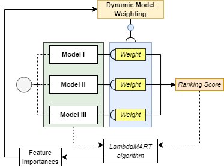

# Enhancing Search Relevance in Information Retrieval Systems Using Dynamic Model Weighting and LambdaMART

## Overview
This research focuses on enhancing search relevance in Information Retrieval Systems (IRSs) by integrating Learning to Rank (LTR) using LambdaMART into Dynamic Model Weighting (DMW). The study aims to improve relevance ranking of search results in custom IRSs by dynamically adjusting model weights based on feature importances compared to a baseline model with fixed model weights.

REMARK: This repo is generalised, as the original codebase cannot be publicly shared due internal agreements of the company contributing to this fundamental research.
Therefore, this codebase is purely meant as inspirational basis for further implications. 

## Objectives
- To understand the impact of Dynamic Model Weighting on search relevance in IRSs.
- To assess the effectiveness of LambdaMART algorithm in determining feature importances for relevance ranking.

## Methodology
- Utilization of a dataset of containing search results per user group with relevance scores based on three model scores (features) and binary true labels.

  
- Extract feature importances using LambdaMART in LightGBM

- Implementation of a baseline model and a dynamic model integrating LambdaMART's normalized and averaged feature importances per user group.

- Performance evaluation based on EDA, accuracy, Precision, Recall and F1 score, and relevance score distribution.

## Main Findings
- Minor improvements in accuracy and F1 score from baseline to dynamic model.
- Notable shifts in relevance score distribution, indicating a nuanced impact of the dynamic model on data distribution.

## Repository Contents
- `Code/`: Directory containing the source code for the baseline and dynamic models.
- `Data/`: Mock dataset used in the study (actual data not publicly available).
- `Results/`: Results and analysis of the model's performance.
- `Images/`: Images of current research results and architecture

## Usage
- Ensure all libraries are installed, using: pip install `requirements.txt`.
- Install https://github.com/microsoft/LightGBM/tree/master/python-package (take time for this)
- The code can be run on local machines with similar specifications, however external GPU is recommended using during a real complete dataset.
- This contains a mock dataset, thus the scores are randomly distributed. This results of the mock dataset are 'meaningless' feature importances.
- This following sources are used to obtain this codebase:
https://scikit-learn.org/stable/modules/generated/sklearn.model_selection.GroupShuffleSplit.html
https://github.com/microsoft/LightGBM/tree/master/python-package
https://github.com/lezzago/LambdaMart

## Contact
- For questions or further information, contact me!
